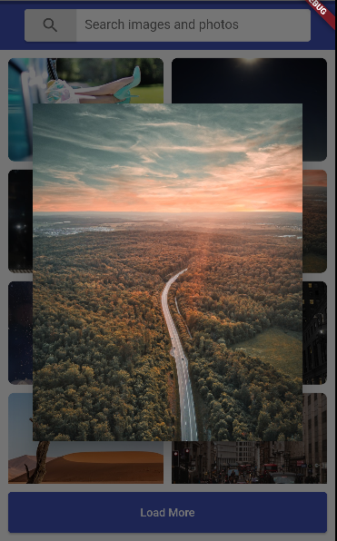

# Image Finder

Simple application with image searching functionality (Pixabay API).




## Installation

Navigate to your project folder and run

```sh
flutter pub get
```

## Architecture project

`models` - Folder that includes all data models. <br/>
`service` - Includes all api requests. <br/>
`widgets` - This directory contains all the basic building blocks for your app. For example a button or a headline widget. <br/>

[//]: # "These are reference links used in the body of this note and get stripped out when the markdown processor does its job. There is no need to format nicely because it shouldn't be seen. Thanks SO - http://stackoverflow.com/questions/4823468/store-comments-in-markdown-syntax"
[Flutter]: https://flutter.dev/
[Pixabay]: https://pixabay.com/api/docs/
